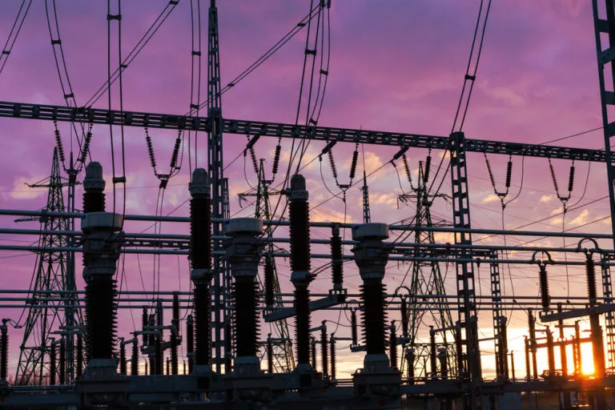

### Static  Electricity 

Static electricity is the buildup of electrical charge on the surface of objects, typically caused by friction between two materials. This charge remains until it is discharged, often resulting in a spark or shock when the stored electrons move from one object to another.

eg: when you rub a balloon against your hair

eg: when you rub a balloon against your hair

### Current Electricity 
Current electricity is the flow of electric charge through a conductor, typically driven by a voltage difference across the conductor. This flow of electrons creates an electric current, which powers devices and systems.

eg: When you plug a lamp into a power outlet, the electric current flows through the wire, allowing the lamp to light up.

